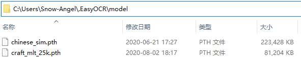
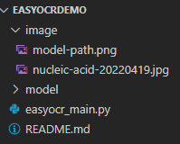
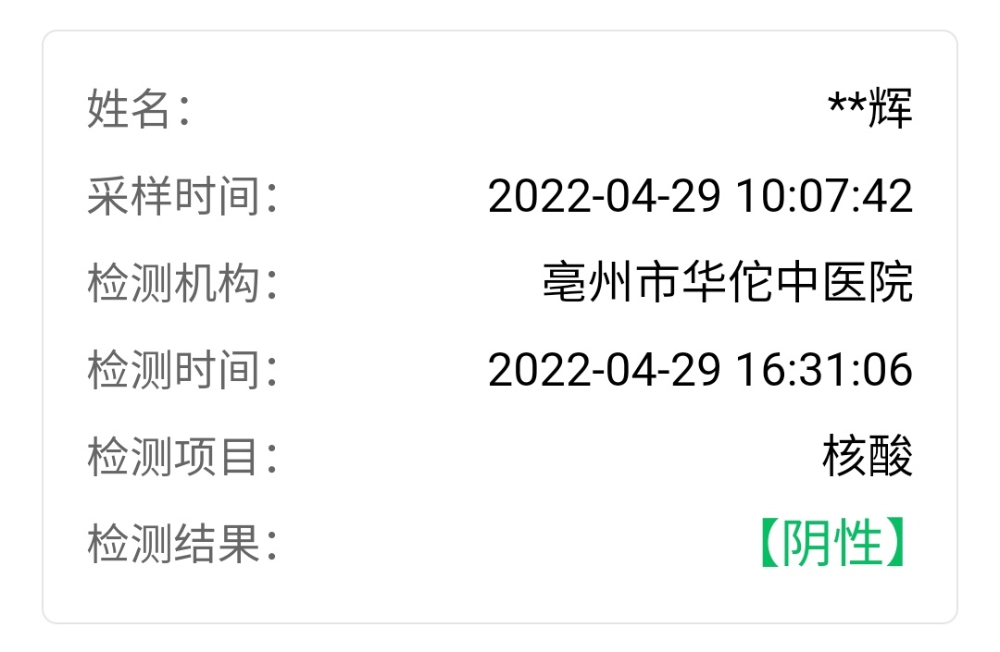

# Easy OCR Demo

## 1. 安装依赖

```cmd
pip install easyocr
```

## 2. 下载模型文件

https://github.com/JaidedAI/EasyOCR/releases/tag/pre-v1.1.6

| 模型文件                                                     | 识别文字                         |
| ------------------------------------------------------------ | -------------------------------- |
| [craft_mlt_25k.zip](https://github.com/JaidedAI/EasyOCR/releases/download/pre-v1.1.6/craft_mlt_25k.zip) | 文字检测模型（CRAFT）（必须）    |
| [chinese_sim.zip](https://github.com/JaidedAI/EasyOCR/releases/download/pre-v1.1.6/chinese_sim.zip) | 中文（简体）模型（识别中文必须） |
| [chinese.zip](https://github.com/JaidedAI/EasyOCR/releases/download/pre-v1.1.6/chinese.zip) | 中文（繁体）模型                 |
| [latin.zip](https://github.com/JaidedAI/EasyOCR/releases/download/pre-v1.1.6/latin.zip) | 拉丁文模型                       |
| [japanese.zip](https://github.com/JaidedAI/EasyOCR/releases/download/pre-v1.1.6/japanese.zip) | 日文模型                         |
| [korean.zip](https://github.com/JaidedAI/EasyOCR/releases/download/pre-v1.1.6/korean.zip) | 韩文模型                         |
| [thai.zip](https://github.com/JaidedAI/EasyOCR/releases/download/pre-v1.1.6/thai.zip) | 泰文模型                         |
| [arabic.zip](https://github.com/JaidedAI/EasyOCR/releases/download/pre-v1.1.6/arabic.zip) | 阿拉伯文模型                     |

模型文件放置位置：
  - Windows：`C:\Users\用户名\.EasyOCR\model\`
  - Linux：`~/.EasyOCR/model/`



## 3. 编写代码

easyocr_main.py
```python
import easyocr
reader = easyocr.Reader(['ch_sim','en'])
result = reader.readtext('image/nucleic-acid-20220419.jpg')

print(result)
```

项目目录结构：


## 4. 运行脚本

example file:


```cmd
python easyocr_main.py

# output
CUDA not available - defaulting to CPU. Note: This module is much faster with a GPU.
[([[87, 89], [215, 89], [215, 149], [87, 149]], '姓名:', 0.9442024230957031), ([[888, 90], [990, 90], [990, 144], [888, 144]], '*辉', 0.3019644837089857), ([[89, 183], [309, 183], [309, 245], [89, 245]], '采样时间:', 0.9722564747406702), ([[522, 186], [992, 186], [992, 240], [522, 240]], '2022-04-2910:07.42', 0.5663659244856294), ([[89, 275], [309, 275], [309, 339], [89, 339]], '检测机构:', 0.928961890809416), ([[582, 272], [992, 272], [992, 336], [582, 336]], '亳州市华佗中医院', 0.9465525282106616), ([[89, 371], [305, 371], [305, 433], [89, 433]], '检测
时间:', 0.9039377327386754), ([[521, 373], [994, 373], [994, 427], [521, 427]], '2022-04-2916:31.06', 0.8148201099036173), ([[88, 465], [310, 465], [310, 525], [88, 525]], '检测项目:', 0.8194704755458363), ([[881, 463], [993, 463], [993, 523], [881, 523]], '核酸', 0.9890416189073347), ([[86, 558], [308, 558], [308, 618], [86, 618]], '检测结果:', 0.6191791236234889), ([[812, 550], [988, 550], [988, 622], [812, 622]], 
'[阴性]', 0.6905605792999268)]
```

## 命令行模式

```cmd
D:\Program\Python\Python37\Scripts\easyocr -l ch_sim en -f image/nucleic-acid-20220419.jpg --detail=1 --gpu=False

# output
([[87, 89], [215, 89], [215, 149], [87, 149]], '姓名:', 0.9442024230957031)
([[888, 90], [990, 90], [990, 144], [888, 144]], '*辉', 0.3019644837089857)
([[89, 183], [309, 183], [309, 245], [89, 245]], '采样时间:', 0.9722564747406702)
([[522, 186], [992, 186], [992, 240], [522, 240]], '2022-04-2910:07.42', 0.5663659244856294)
([[89, 275], [309, 275], [309, 339], [89, 339]], '检测机构:', 0.928961890809416)
([[582, 272], [992, 272], [992, 336], [582, 336]], '亳州市华佗中医院', 0.9465525282106616)
([[89, 371], [305, 371], [305, 433], [89, 433]], '检测时间:', 0.9039377327386754)
([[521, 373], [994, 373], [994, 427], [521, 427]], '2022-04-2916:31.06', 0.8148201099036173)
([[88, 465], [310, 465], [310, 525], [88, 525]], '检测项目:', 0.8194704755458363)
([[881, 463], [993, 463], [993, 523], [881, 523]], '核酸', 0.9890416189073347)
([[86, 558], [308, 558], [308, 618], [86, 618]], '检测结果:', 0.6191791236234889)
([[812, 550], [988, 550], [988, 622], [812, 622]], '[阴性]', 0.6905605792999268)

# usage
easyocr [-h] -l LANG [LANG ...] [--gpu {True,False}]
        [--model_storage_directory MODEL_STORAGE_DIRECTORY]
        [--user_network_directory USER_NETWORK_DIRECTORY]
        [--recog_network RECOG_NETWORK]
        [--download_enabled {True,False}] [--detector {True,False}]
        [--recognizer {True,False}] [--verbose {True,False}]
        [--quantize {True,False}] -f FILE
        [--decoder {greedy,beamsearch,wordbeamsearch}]
        [--beamWidth BEAMWIDTH] [--batch_size BATCH_SIZE]
        [--workers WORKERS] [--allowlist ALLOWLIST]
        [--blocklist BLOCKLIST] [--detail {0,1}]
        [--rotation_info ROTATION_INFO] [--paragraph {True,False}]
        [--min_size MIN_SIZE] [--contrast_ths CONTRAST_THS]
        [--adjust_contrast ADJUST_CONTRAST]
        [--text_threshold TEXT_THRESHOLD] [--low_text LOW_TEXT]
        [--link_threshold LINK_THRESHOLD] [--canvas_size CANVAS_SIZE]
        [--mag_ratio MAG_RATIO] [--slope_ths SLOPE_THS]
        [--ycenter_ths YCENTER_THS] [--height_ths HEIGHT_THS]
        [--width_ths WIDTH_THS] [--y_ths Y_THS] [--x_ths X_THS]
        [--add_margin ADD_MARGIN]

Process EasyOCR.

optional arguments:
  -h, --help            show this help message and exit
  -l LANG [LANG ...], --lang LANG [LANG ...]
                        for languages
  --gpu {True,False}    Using GPU (default: True)
  --model_storage_directory MODEL_STORAGE_DIRECTORY
                        Directory for model (.pth) file
  --user_network_directory USER_NETWORK_DIRECTORY
                        Directory for custom network files
  --recog_network RECOG_NETWORK
                        Recognition networks
  --download_enabled {True,False}
                        Enable Download
  --detector {True,False}
                        Initialize text detector module
  --recognizer {True,False}
                        Initialize text recognizer module
  --verbose {True,False}
                        Print detail/warning
  --quantize {True,False}
                        Use dynamic quantization
  -f FILE, --file FILE  input file
  --decoder {greedy,beamsearch,wordbeamsearch}
                        decoder algorithm
  --beamWidth BEAMWIDTH
                        size of beam search
  --batch_size BATCH_SIZE
                        batch_size
  --workers WORKERS     number of processing cpu cores
  --allowlist ALLOWLIST
                        Force EasyOCR to recognize only subset of characters
  --blocklist BLOCKLIST
                        Block subset of character. This argument will be
                        ignored if allowlist is given.
  --detail {0,1}        simple output (default: 1)
  --rotation_info ROTATION_INFO
                        Allow EasyOCR to rotate each text box and return the
                        one with the best confident score. Eligible values are
                        90, 180 and 270. For example, try [90, 180 ,270] for
                        all possible text orientations.
  --paragraph {True,False}
                        Combine result into paragraph
  --min_size MIN_SIZE   Filter text box smaller than minimum value in pixel
  --contrast_ths CONTRAST_THS
                        Text box with contrast lower than this value will be
                        passed into model 2 times. First is with original
                        image and second with contrast adjusted to
                        'adjust_contrast' value. The one with more confident
                        level will be returned as a result.
  --adjust_contrast ADJUST_CONTRAST
                        target contrast level for low contrast text box
  --text_threshold TEXT_THRESHOLD
                        Text confidence threshold
  --low_text LOW_TEXT   Text low-bound score
  --link_threshold LINK_THRESHOLD
                        Link confidence threshold
  --canvas_size CANVAS_SIZE
                        Maximum image size. Image bigger than this value will
                        be resized down.
  --mag_ratio MAG_RATIO
                        Image magnification ratio
  --slope_ths SLOPE_THS
                        Maximum slope (delta y/delta x) to considered merging.
                        Low value means tiled boxes will not be merged.
  --ycenter_ths YCENTER_THS
                        Maximum shift in y direction. Boxes with different
                        level should not be merged.
  --height_ths HEIGHT_THS
                        Maximum different in box height. Boxes with very
                        different text size should not be merged.
  --width_ths WIDTH_THS
                        Maximum horizontal distance to merge boxes.
  --y_ths Y_THS         Maximum horizontal distance to merge boxes (when
                        paragraph = True).
  --x_ths X_THS         Maximum horizontal distance to merge boxes (when
                        paragraph = True).
  --add_margin ADD_MARGIN
                        Extend bounding boxes in all direction by certain
                        value. This is important for language with complex
                        script (E.g. Thai).
```

## References

Github: https://github.com/JaidedAI/EasyOCR
[Python3行代码翻译70种语言！](https://mp.weixin.qq.com/s/bWfVi1gmfuafGc14UKEkNw)